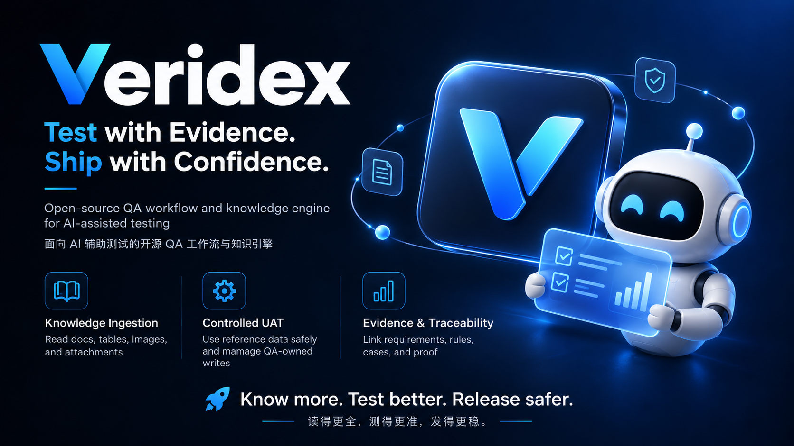

<div align="center">

# Veridex

**Test with Evidence. Ship with Confidence.**

Evidence-driven QA workflow and knowledge engine for AI-assisted testing.  
面向 AI 辅助测试的证据驱动 QA 工作流与知识引擎。

[English](#english) · [中文](#中文)




</div>

---

# English

## What is Veridex?

Veridex is an open QA framework for building **trustworthy AI-assisted testing workflows**.

Instead of asking an LLM to read a requirement and immediately generate test cases, Veridex separates AI reasoning from deterministic validation:

```text
Source
  ↓
Requirement
  ↓
Business Rule
  ↓
Impact
  ↓
Test Decision
  ↓
Test Case
  ↓
Execution
  ↓
Evidence
  ↓
Report
```

**AI may reason, but facts, execution results, and PASS conclusions must remain traceable and verifiable.**

## Why Veridex?

High-quality testing depends on more than generating many cases:

- Was the requirement read completely, including tables, images, links, and attachments?
- Is the expected result grounded in a real source?
- Did a historical rule silently override a current rule?
- Why does each test case exist?
- Was the case actually executed?
- Is there assertion evidence behind PASS?
- Was an environment failure incorrectly reported as a product failure?
- Did the test leave dirty data in UAT?

Veridex turns those questions into explicit quality gates.

## Core capabilities

| Capability | What Veridex does |
|---|---|
| Knowledge ingestion | Normalizes Confluence pages, tables, links, images, and attachments |
| Draft knowledge | AI-extracted knowledge stays draft/reviewable instead of becoming truth automatically |
| Conflict detection | Conflicting rules are surfaced for review rather than silently overwritten |
| Test-data governance | Separates REFERENCE, OWNED, and DERIVED data |
| Controlled UAT CRUD | Existing data stays read-only; QA-owned data can be safely created, changed, and cleaned |
| Bulk-write approval | Large writes require explicit approval and runtime approval matching |
| Deterministic execution | Validates plans before running isolated unittest cases |
| Evidence-backed PASS | Runner success without assertion evidence cannot become PASS |
| Conservative status | Distinguishes PASS, FAIL, BLOCKED, and NOT_RUN |
| Traceability | Links source → rule → case → execution → evidence |

## Architecture

```text
                     Veridex
                        │
        ┌───────────────┴───────────────┐
        │                               │
 Knowledge & Analysis              Execution & Evidence
        │                               │
 Confluence / CME / Docling         workflow.py
 Source Package                    execute_case.py
 Draft Knowledge                   qa_evidence.py
 Merge / Conflict                  qa_core/
 Review Queue                          │
        │                               │
        └───────────────┬───────────────┘
                        │
                    AI / Codex
```

The public repository contains only generic framework code. Real project endpoints, schemas, Jira keys, database/table names, credentials, and test data belong in a private project profile.

## Test-data model

### REFERENCE

Existing environment data used as input or an association anchor. An existing account, order, tenant, or other deeply linked record can be reused without rebuilding its entire data graph.

- Query / SELECT: ✅
- Use as input or join key: ✅
- UPDATE existing row: ❌
- DELETE existing row: ❌

### OWNED

Data created by the current QA run/case.

- INSERT: ✅
- UPDATE: ✅
- DELETE: ✅
- Cleanup before PASS: required

### DERIVED

Data produced by the system because a test triggered a service, job, API, or message flow.

Derived data is **not automatically owned**. A project adapter must prove correlation before it can be adopted and cleaned.

See [Test Data Governance](docs/data-governance.md).

## Controlled UAT writes

A write-capable case declares a policy:

```json
{
  "write_policy": {
    "scope": "test_data_mutate",
    "estimated_rows": 5,
    "cleanup_required": true
  }
}
```

Supported scopes: `readonly`, `test_data_create`, `test_data_mutate`, and `bulk_write`.

Large writes require both plan approval and a matching runtime approval reference. Even when the business assertion passes, Veridex changes the final result to **BLOCKED** if QA-owned data is not cleaned up.

See [Controlled UAT Write Policy](docs/uat-write-safety.md).

## Complex Confluence ingestion

Recommended pipeline:

```text
Confluence
   ↓
confluence-markdown-exporter
   ↓
Veridex Source Package
   ↓
Docling for PDF / Word / Excel / PPT / images
   ↓
AI extraction task
   ↓
Draft Knowledge
   ↓
Merge / Conflict / Review
```

Raster flowcharts remain visual-review items even when OCR succeeds. Recognizing text is not treated as understanding business logic.

## Quick start

```bash
git clone https://github.com/TUVGO/Veridex.git
cd Veridex
python -m venv .venv
pip install -e .
python -m unittest discover -s tests -v
veridex demo --output work/demo
```

Windows PowerShell:

```powershell
.\.venv\Scripts\Activate.ps1
```

From a source checkout, you can also run:

```bash
python qa_brain.py demo --output work/demo
```

## Project status

Veridex is currently **pre-alpha**.

Implemented foundations:

- deterministic execution and evidence engine;
- Confluence inventory and incremental sync;
- CME + Docling ingestion adapters;
- structured tables, links, and assets;
- draft knowledge merge, conflict, and review;
- REFERENCE / OWNED / DERIVED data governance;
- controlled UAT writes and cleanup gates.

Planned next:

- explainable knowledge search;
- requirement context parsing;
- clarification gates;
- impact analysis;
- Impact → Test Decision → Case traceability;
- generic DB / API / MQ / browser adapters;
- MCP interface;
- optional team UI.

## Contributing

Contributions are welcome while the architecture is evolving. Keep core behavior generic and put system-specific behavior behind adapters or configuration.

See [CONTRIBUTING.md](CONTRIBUTING.md).

## Security

Do not publish credentials, internal endpoints, real customer identifiers, or organization-specific test data in issues or pull requests.

See [SECURITY.md](SECURITY.md).

---

# 中文

## Veridex 是什么？

Veridex 是一个面向 **AI 辅助测试** 的开放 QA 框架，目标是让测试过程可验证、可追溯、可复现。

它不是简单地让 AI 读完需求就直接批量生成测试用例，而是建立完整可信链路：

```text
来源 Source
   ↓
需求 Requirement
   ↓
业务规则 Rule
   ↓
影响分析 Impact
   ↓
测试决策 Test Decision
   ↓
测试用例 Case
   ↓
真实执行 Execution
   ↓
证据 Evidence
   ↓
报告 Report
```

> **AI 可以负责推理，但事实、执行结果和 PASS 结论必须能够被确定性程序与证据验证。**

## 为什么做 Veridex？

AI 很容易一次生成几十甚至几百条测试用例，但测试质量真正取决于：

- 需求正文、表格、图片、流程图、链接、附件是不是都读到了？
- Expected 是否真的有需求或规则来源？
- 历史规则有没有被错误当成当前规则？
- 每条 Case 为什么存在？
- Case 到底有没有真实执行？
- PASS 有没有真实断言证据？
- 环境故障有没有被错误算成产品 FAIL？
- UAT 测试结束后有没有留下脏数据？

Veridex 把这些问题变成明确的 **Quality Gate**。

## 核心能力

| 能力 | Veridex 的处理方式 |
|---|---|
| 知识采集 | 读取并归一化 Confluence 正文、表格、链接、图片和附件 |
| Draft Knowledge | AI 提取结果默认进入草稿/审核，而不是自动成为事实 |
| 冲突检测 | 不同文档中的冲突规则不会静默覆盖 |
| 测试数据治理 | 区分 REFERENCE、OWNED、DERIVED |
| 受控 UAT CRUD | 原始数据只读，QA 自建数据可安全增删改并清理 |
| 批量写审批 | 大批量写入需要审批并在运行时再次校验 |
| 确定性执行 | Plan 校验后逐条执行独立 unittest |
| Evidence PASS | Runner 成功但没有断言证据，不能判 PASS |
| 保守状态语义 | PASS / FAIL / BLOCKED / NOT_RUN 明确区分 |
| 全链路追溯 | Source → Rule → Case → Execution → Evidence |

## 测试数据模型

### REFERENCE — 既有参考数据

UAT 中已经存在的数据，可以直接作为测试输入和关联锚点。例如一个已经关联大量历史数据的用户 / 订单 / 租户，不需要为了测试重新完整造一套。

- 查询：✅
- 作为接口参数：✅
- 作为 JOIN / 关联条件：✅
- UPDATE 原始记录：❌
- DELETE 原始记录：❌

### OWNED — QA 自建数据

当前 QA Run / Case 创建的数据可以受控 INSERT / UPDATE / DELETE，但测试结束前必须完成 Cleanup。

### DERIVED — 测试触发产生的数据

例如调用真实接口或任务后，系统自己生成的记录、任务、消息结果。DERIVED 不会自动被当作 QA-owned，必须由项目 Adapter 证明它与当前 Run 的关联关系后，才能认领和清理。

详见 [测试数据治理](docs/data-governance.md)。

## UAT 受控写入

写用例通过 `write_policy` 声明写范围和预计影响行数。支持：

- `readonly`
- `test_data_create`
- `test_data_mutate`
- `bulk_write`

大批量写入需要 Plan 审批 + 运行时审批引用双重匹配。即使业务断言已经 PASS，只要 QA-owned 数据没有清理干净，最终结果仍会变成 **BLOCKED**。

## 复杂 Confluence 文档

复杂需求文档推荐：

```text
Confluence
   ↓
confluence-markdown-exporter
   ↓
Veridex Source Package
   ↓
Docling 解析 PDF / Word / Excel / PPT / 图片
   ↓
AI Extraction Task
   ↓
Knowledge Draft
   ↓
Merge / Conflict / Human Review
```

对于普通截图和长流程图，即使 OCR 成功，也仍保留 `visual_review_required`，避免把“识别到了文字”误认为“理解了业务流程”。

## 快速开始

```bash
git clone https://github.com/TUVGO/Veridex.git
cd Veridex
python -m venv .venv
pip install -e .
python -m unittest discover -s tests -v
veridex demo --output work/demo
```

Windows PowerShell：

```powershell
.\.venv\Scripts\Activate.ps1
```

## 当前阶段

Veridex 目前处于 **Pre-Alpha**。

已经具备：

- 确定性执行与证据引擎；
- Confluence Inventory / 增量同步；
- CME + Docling 复杂文档采集；
- 表格、链接、图片、附件结构化；
- Knowledge Draft / Merge / Conflict / Review；
- REFERENCE / OWNED / DERIVED 数据治理；
- UAT 受控 CRUD、批量审批和 Cleanup Gate。

下一阶段：

- 可解释 Knowledge Search；
- Requirement Context Parser；
- Clarification Gate；
- Impact Analysis；
- Impact → Test Decision → Case；
- 通用 DB / API / MQ / Browser Adapter；
- MCP；
- 可选 Web UI。

## 贡献与安全

核心层应保持通用，业务系统差异通过 Adapter / Profile / Config 扩展。请不要在 Issue / PR 中提交公司内部地址、账号凭据、真实客户标识、真实测试数据或未授权业务文档。

参见 [CONTRIBUTING.md](CONTRIBUTING.md) 与 [SECURITY.md](SECURITY.md)。

---

<div align="center">

**Know more. Test better. Release safer.**  
**读得更全，测得更准，发得更稳。**

</div>
